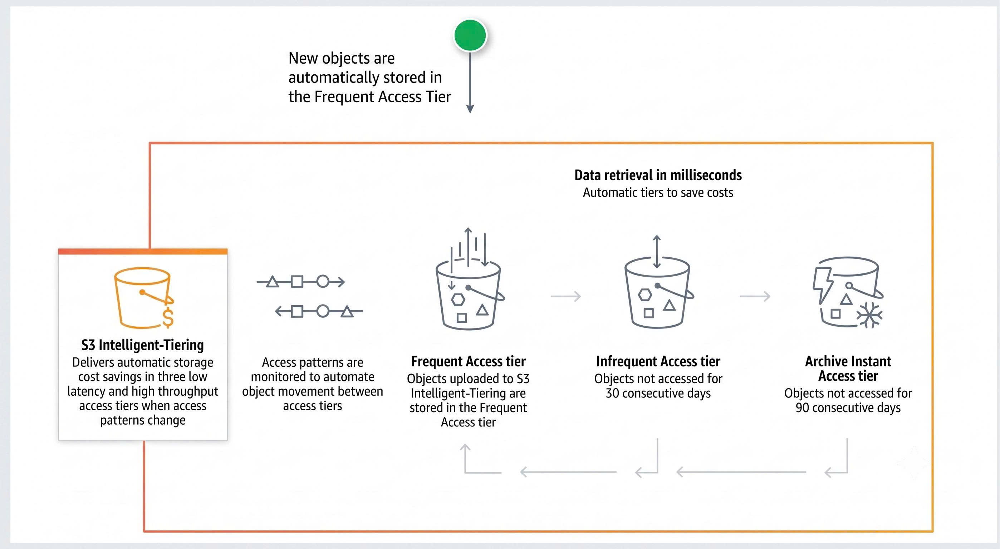

# S3 INTELLIGENT-TIERING – WHEN STORAGE "KNOWS" WHERE IT SHOULD LIVE

During the process of building a data lake on S3, many teams encounter a common problem: data volume keeps growing, but the access patterns for each type of data are hard to predict. Some files are read continuously, some are read only a few times then forgotten, and some are hardly touched after upload. Leaving everything on S3 Standard can drive up costs, while manually reviewing and moving storage classes is operationally expensive. This is where **S3 Intelligent-Tiering** proves useful.

The most notable feature of this storage class is that it "observes" each object's access behavior and automatically places it in the appropriate cost tier without human intervention.

Key points to know:

* There are 3 fully automatic access tiers: **Frequent Access** (the default tier for new objects, for frequently accessed data), **Infrequent Access** (objects automatically move here after 30 days without access, with lower cost), and **Archive Instant Access** (objects automatically move here after 90 days without access, with even lower cost but still instant retrieval).
* You can enable 2 additional asynchronous archive tiers for deeper savings: **Archive Access** (after a minimum of 90 days without access, retrieval time about 3–5 hours) and **Deep Archive Access** (after a minimum of 180 days, retrieval within 12 hours). These time thresholds can be customized up to 730 days.
* There are no data retrieval fees charged for any tier, even when an object resides in an archive tier.
* The primary additional cost is a small monitoring fee per object per month; objects under 128 KB are exempt from this fee, which suits systems with many small files (logs, metadata, thumbnails...).
* This is best suited for data lakes with diverse data sources where predicting access patterns is nearly impossible.
* If you are 100% certain that a dataset will be read only once and stored long-term (for example, scheduled backups), moving it directly to Glacier or Standard-IA manually may be more optimal to avoid the monthly monitoring fee.

This feature is particularly useful when data volume is large, access patterns change over time, and the team prefers to avoid the operational effort of monitoring and manually changing storage classes.

### Architecture Diagram

### References & Published Posts
- [Manage Amazon S3 storage costs granularly and at scale using S3 Intelligent-Tiering](https://aws.amazon.com/vi/blogs/storage/manage-amazon-s3-storage-costs-granularly-and-at-scale-using-s3-intelligent-tiering/)
- [Post on AWS Study Group FCJ Community:](https://www.facebook.com/groups/awsstudygroupfcj/posts/2205182253580068/?__cft__[0]=AZbu5cOv4xtEKWKrodKp7X_xKqVg4rNSva2B9IQn4pMhfNym4CPkPRWKqlreoQbv5f_WcvDZJsWbR76KMJRVWa7Kpzx7u9AwI-1XxQ9rWwmnoEbYljZ9P4hcxxFkLSQ71UVR4Nh7uJlQyTplPDaddTwt7slrTmQRRGcK27qFBjUWBMQEuAsDLj6p8W_UQsPCxIIDGCofT1ygQBeAhtYkXBmo&__tn__=%2CO%2CP-R)
