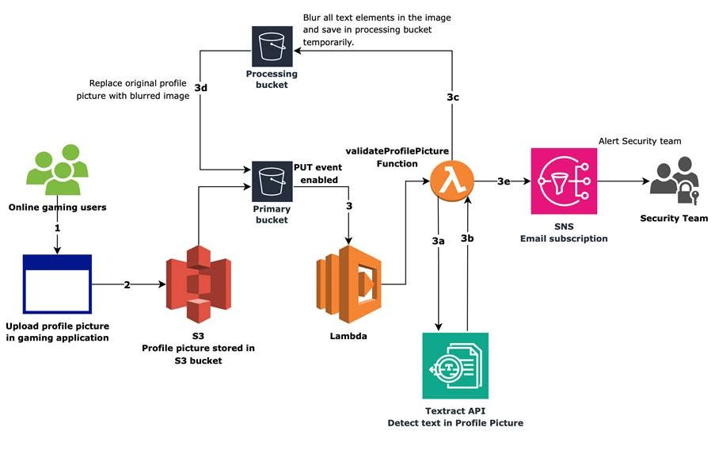

# ENSURING FAIR PLAY BY DETECTING AND PREVENTING PROFILE ALTERATIONS WITH AMAZON TEXTRACT

In the development and operation of multiplayer online games, maintaining a fair and healthy gaming environment is always a top priority. Typically, we focus on anti-hack/cheat measures in game code, but there is a very subtle form of cheating that traditional security systems often overlook: profile picture abuse.

When initially building a game system, I thought simply that users could upload whatever image they wanted, and at most we'd use a filter to check for sensitive images. However, when digging deeper into collusion schemes and reading AWS's solution sharing, I realized that "clever" players often embed phone numbers, Discord links, or private chat room codes directly into their profile pictures to communicate secretly, cheat in pairs, or lure players away from the system.

To solve this problem automatically and optimally, AWS has proposed an extremely intelligent Serverless architecture using Amazon Textract to scan and blur text on images immediately upon upload.

### The Problem: Traditional Approach Limitations

When initially considering the problem of processing text on images, I immediately thought of having to set up a separate EC2 server, installing heavy libraries like OpenCV or running self-trained AI character recognition (OCR) models. This approach brings numerous challenges:

- **High maintenance costs:** Maintaining a 24/7 server even when gamers aren't constantly changing profile pictures
- **Slow performance:** System becomes slow when large numbers of new players register simultaneously
- **Low accuracy:** Poor accuracy with handwritten text or unusual fonts

### The Serverless Solution

After researching AWS's solution, I realized that the Serverless mindset combined with AI Managed Services solves everything neatly without managing any servers.

The Serverless architecture helps optimize the processing workflow:

1. **User uploads image:** New profile picture is pushed to the main Amazon S3 Bucket (Primary Bucket). This event immediately triggers an AWS Lambda function.

2. **Extract text coordinates with Amazon Textract:** The Lambda function doesn't process the image itself but forwards it to Amazon Textract. This AI service automatically analyzes, detects all text (both printed and handwritten), and returns precise coordinates (Bounding Boxes) of the text regions.

3. **Blurring processing:** Lambda receives the text coordinates, uses Gaussian Blur filter to blur exactly the sensitive information areas.

4. **Secure storage:** The processed image is temporarily saved to an S3 processing bucket (to avoid infinite loop triggering), then overwrites the original image in the Primary Bucket.

5. **Send alerts:** Amazon SNS simultaneously sends an email notification to the game Admin team informing which account just attempted to embed text in their profile picture.

### Key Benefits

The biggest lesson I learned from this solution is: **Don't try to code what cloud services have already optimized.**

Instead of spending weeks building unstable OCR filters, combining Amazon Textract with the Serverless Lambda model gives the system both:
- **High AI accuracy** for text detection
- **Automatic scaling** according to player numbers
- **Cost optimization** - you only pay per millisecond of processing and per image actually scanned, with no hidden costs when there are no users

### Architecture Diagram

### Technical Implementation Highlights

- **Event-driven processing:** S3 event notifications trigger Lambda functions only when images are uploaded, eliminating idle server costs
- **Managed AI service:** Amazon Textract handles text detection with high accuracy for multiple languages and handwriting styles
- **Automated moderation:** Gaussian blur applied to detected text regions while preserving image quality
- **Alert system:** SNS notifications enable real-time monitoring and response to policy violations
- **Cost-effective:** Pay-per-use model with no infrastructure maintenance overhead

### References & Published Posts

- **Original AWS GameTech Blog Post:** [Ensuring fair play by detecting and preventing profile alterations with Amazon Textract](https://aws.amazon.com/blogs/gametech/ensuring-fair-play-by-detecting-and-preventing-profile-alterations-with-amazon-textract/)